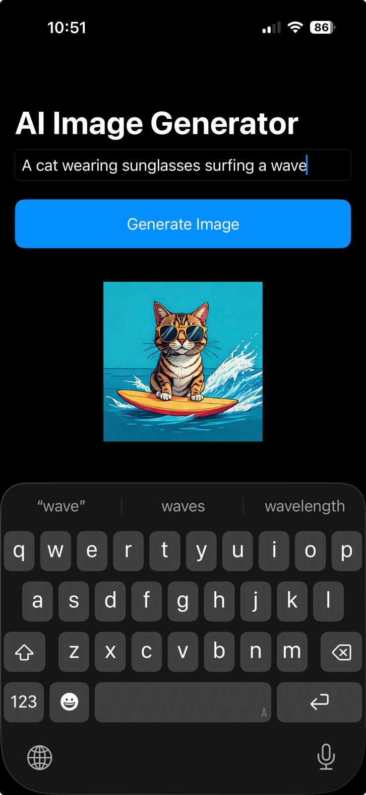

# 🧠 AI Image Generator (iOS)

A simple and powerful SwiftUI app that generates beautiful AI illustrations from text prompts using Apple's **ImagePlayground** framework. Just type a prompt and watch your imagination come to life — all on-device and lightning fast.

---

## 📸 Features

- ✅ Prompt-based image generation
- 🎨 Uses `ImagePlayground`'s `.illustration` style
- 🧠 Async image generation with Swift concurrency
- ⚠️ Graceful error handling
- 🚀 Built entirely in SwiftUI

---

## 📱 Requirements

- Xcode 16+
- iOS 18+
- Swift Concurrency support (iOS 15+ baseline if using modern SwiftUI)

---

## 🛠️ Installation

1. Clone the repo:
   ```bash
   git clone https://github.com/mizadi/AIImageGenerator.git
   ```

2. Open the project in Xcode:
   ```bash
   open AIImageGenerator.xcodeproj
   ```

3. Build and run on an iOS 18+ simulator or device.

> 🔒 No API keys, no cloud dependencies — the app uses Apple’s on-device AI image generation.

---

## 🚀 Usage

1. Launch the app
2. Type any creative prompt into the input field
3. Tap **"Generate Image"**
4. Wait a few seconds — your illustration will appear!

---

## 💡 Example

**Prompt:**

> _A cat wearing sunglasses surfing a wave_

**Result:**



> ⚠️ Your results may vary — ImagePlayground creates new images every time based on the prompt and style.

---

## 📂 Folder Structure

```
.
├── PromptImageView.swift      # Main SwiftUI interface
├── ImageGenerator.swift       # Image generation logic
├── AIImageGeneratorApp.swift  # App entry point
├── Assets.xcassets            # App icons & colors
├── example/
│   └── cat-surfing.png        # Example result image
└── README.md
```

---

## 🧩 Built With

- [SwiftUI](https://developer.apple.com/documentation/swiftui/)
- [ImagePlayground](https://developer.apple.com/documentation/imageplayground)
- [Swift Concurrency (async/await)](https://docs.swift.org/swift-book/LanguageGuide/Concurrency.html)

---

## 📌 License

This project is licensed under the MIT License. Feel free to fork, use, and build on it.

---

## 🙌 Acknowledgments

Thanks to Apple for introducing ImagePlayground and on-device creativity tools. This app was inspired by the potential of AI and SwiftUI together.
